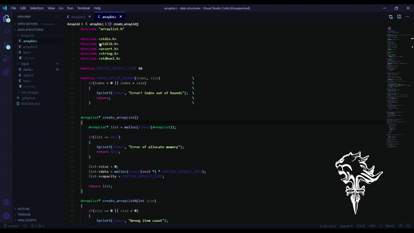

# My Visual Code theme for C
## What does it look like?

## How do I set it up?
First, you need to configure these plugins for your Visual Code:
* [C/C++](https://marketplace.visualstudio.com/items?itemName=ms-vscode.cpptools)
* [Material Theme](https://marketplace.visualstudio.com/items?itemName=Equinusocio.vsc-material-theme) ([Github](https://github.com/material-ocean/Material-Ocean))
* [Background](https://marketplace.visualstudio.com/items?itemName=shalldie.background) ([Github](https://github.com/shalldie/vscode-background))  

After installing all plugins, change your setting.json ([How to do it](https://code.visualstudio.com/docs/getstarted/settings)) to [this](https://github.com/ThePersonThat/vscode-theme/blob/master/settings.json).

That's it! Enjoy
